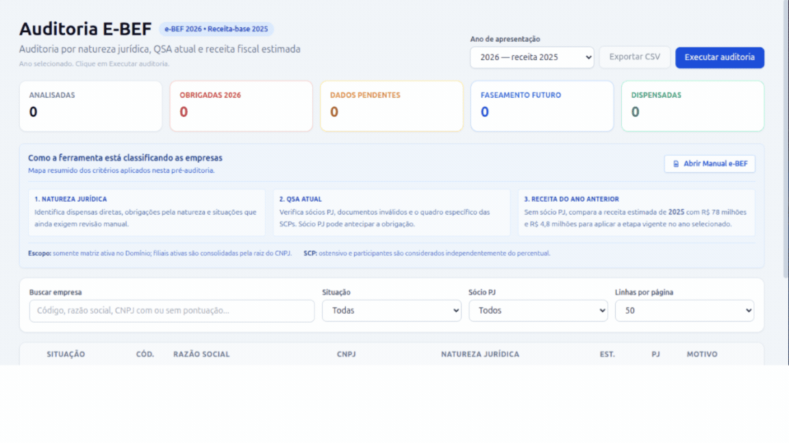

# 📊 Auditor e-BEF (Formulário Digital de Beneficiários Finais)



Um script automatizado em Python para analisar, auditar e classificar a carteira de clientes de escritórios contábeis quanto à obrigatoriedade de entrega do **e-BEF (Instrução Normativa RFB nº 2.290/2025)**.

## O que o projeto faz?
A partir de 1º de janeiro de 2026, a Receita Federal passou a exigir que pessoas jurídicas prestem informações sobre seus beneficiários finais através do e-BEF. A norma possui diversas regras complexas de **dispensa direta, faseamento por faturamento (2027 e 2028) e exceções baseadas na composição do Quadro de Sócios e Administradores (QSA)**.

Este script conecta-se ao banco de dados do sistema ERP contábil, varre o cadastro de todas as empresas ativas, analisa o quadro societário e o faturamento estimado, e gera um relatório completo classificando cada empresa no seu status de obrigatoriedade.

## Para que serve?
O objetivo principal é **eliminar o trabalho manual de triagem**. Em vez de a equipe contábil ou paralegal abrir o cadastro de dezenas (ou centenas) de empresas uma a uma para checar faturamento e QSA, o script entrega um diagnóstico pronto.

Ele classifica as empresas em status claros, como:
*   🟢 **DISPENSADA:** Empresa dispensada diretamente pela Natureza Jurídica (ex: MEI, Administração Pública).
*   🔴 **OBRIGADA_2026:** Empresa que não se enquadra em dispensas ou faseamento (ex: Limitada com Sócio PJ).
*   🟡 **FASEAMENTO_2027 / 2028:** Empresa dispensada temporariamente por critério de faturamento.
*   🟠 **DISPENSA_PROVAVEL:** Abaixo do limite de faturamento (requer apenas validação final da ECF).
*   ⚠️ **DADOS_INCONSISTENTES:** Alerta para CNPJs inválidos ou divergências no cadastro.
*   🔎 **REVISAO_MANUAL:** Casos subjetivos (ex: Fundos e Entidades Sem Fins Lucrativos).

## Como funciona?
O algoritmo aplica com rigor as regras do Manual do e-BEF:
1.  **Consolidação de Matriz e Filiais:** Agrupa os dados usando os 8 primeiros dígitos do CNPJ, já que a entrega é centralizada na matriz.
2.  **Validação Documental:** Checa se os CPFs e CNPJs cadastrados no sistema são matematicamente válidos.
3.  **Auditoria de SCPs:** Identifica Sociedades em Conta de Participação e consolida automaticamente os sócios participantes junto ao sócio ostensivo.
4.  **Análise de Faseamento:** Cruza a presença de Pessoas Jurídicas no QSA com o faturamento anual para enquadrar a empresa no ano correto de obrigatoriedade.

## Compatibilidade: Domínio Sistemas
Este projeto foi construído e otimizado para rodar em bancos de dados **Sybase SQL Anywhere**, operando especificamente com o layout de tabelas da **Thomson Reuters (Domínio Sistemas)** (tabelas do schema `bethadba`).

**Utiliza outro sistema contábil (Alterdata, Questor, Fortes, etc.)?**
A lógica de classificação (`_classificar_empresa`) escrita em Python é **universal** e serve para qualquer cenário. No entanto, para usar com outros sistemas, você precisará adaptar a string de conexão e a query SQL no método `get_relatorio_ebef()` para refletir a estrutura e o banco de dados (PostgreSQL, SQL Server, Firebird, etc.) do seu ERP.

## Como começar

### Pré-requisitos
*   Python 3.8+
*   Driver ODBC do SQL Anywhere 17 instalado na máquina.
*   Acesso de leitura ao banco de dados da Domínio (host, porta, usuário e senha).

### Instalação
1. Clone o repositório:
   ```bash
   git clone [https://github.com/seu-usuario/auditor-ebef.git](https://github.com/seu-usuario/auditor-ebef.git)
   cd auditor-ebef